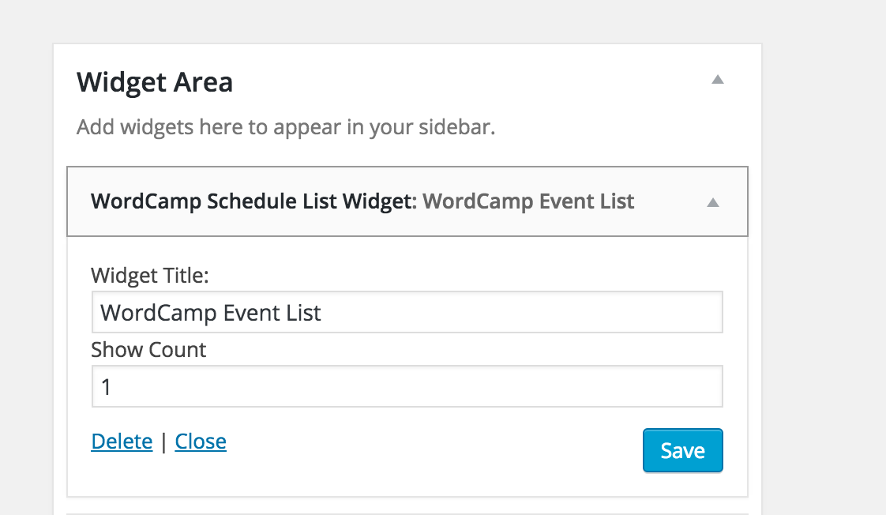
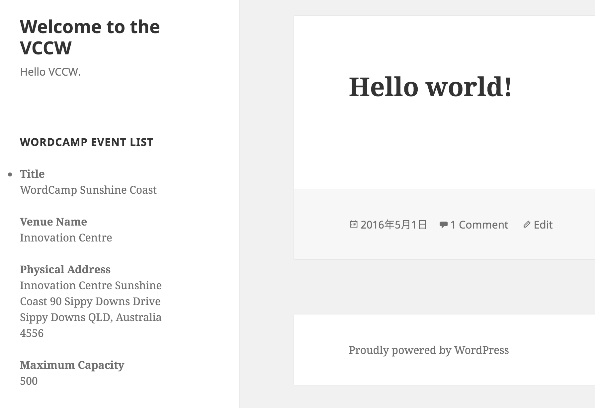

# WC Schedule Widget #
  
**Contributors:** hideokamoto  
**Tags:** widget,wordcamp  
**Requires at least:** 4.4.2  
**Requires PHP Version:** 5.5.0 or greater  
**Tested up to:** 4.4.2  
**Stable tag:** 0.1.0  
**License:** GPLv2 or later  
**License URI:** http://www.gnu.org/licenses/gpl-2.0.html  

Show WordCamp Event List Widget.

## Description ##
Show WordCamp Event List Widget.

## Screenshot ##
  

## Installation ##

1. Upload `wc-schedule-widget.zip` to the `/wp-content/plugins/` directory
2. Unzip uploaded file.
3. Activate the plugin through the 'Plugins' menu in WordPress
4. Place `WordCamp Scheduler Widget` in your site.

## Changelog ##

### 0.1.0 ###
* Release

## Upgrade Notice ##

### 0.1.0 ###
* Release
